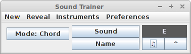

# Sound Trainer 

**Sound Trainer** helps musicians to train. It picks a random note/chord and 
you have to guess either the sound or the name. You can also view its 
position on instruments. 

Current version :  

## Requirements 

### Features 

- Play notes/chords randomly selected
- 2 modes: guess the name or guess the sound
- Showing positions on instruments

### Options 

- left-handed mode (for guitar)
- select played chords/notes (presets for guitar, bass, piano) [Soon]
- filter notes (*#* or *minor* included or not) [Soon]
- ignore the pitch (*C4 = C5*) [Soon]
- set volume
- set delay between two notes
- set duration of sounds 
- change default instrument for playing sounds

### Extra 

- add/remove instruments
- users could add their own chords